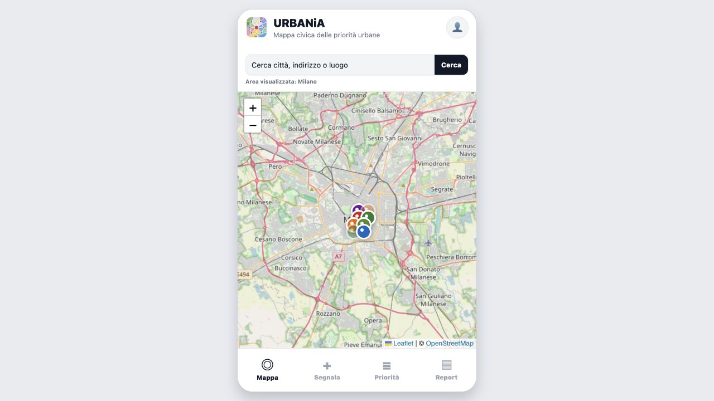

# URBANiA

<p align="center">
  
</p>

URBANiA is an interactive civic-reporting prototype that turns fragmented reports from residents into structured information that municipalities can review and prioritize.

[Open the live app](https://collivignarellioffice-byte.github.io/urbania-civic-app/) · [Read the product presentation](https://collivignarellioffice-byte.github.io/urbania-civic-app/presentation/) · [Visit Martina's portfolio](https://martinacollivignarelli.com/)



## What the prototype demonstrates

- an interactive OpenStreetMap view of civic reports across Italian cities;
- place and address search with geocoding;
- a structured flow for creating a new report;
- report confirmation and status updates;
- a transparent priority score based on urgency, volume, persistence and status;
- city-level summaries that can be shared or printed as PDF;
- a responsive interface: phone-sized on desktop and full-screen on mobile.

## Product context

The project began as a university product concept about civic participation. The presentation explains the problem, service model, public-administration dashboard, business model and infrastructure. This repository contains both the working citizen-facing MVP and the presentation source.

The current prototype uses synthetic seed data and stores changes only in the current browser session. Priority scores and civic summaries are generated through deterministic rules visible in the source code; no machine-learning model or LLM is used in this version.

## Tech stack

- Expo 54 and React Native
- React Native Web
- Leaflet and OpenStreetMap for the web map
- `react-native-maps` for native builds
- Nominatim for place search
- Expo Location, Print and Sharing for native capabilities

The local `MapView` adapter keeps the same application components while selecting Leaflet on the web and `react-native-maps` on iOS and Android.

## Run locally

Requirements: Node.js 20.19.4 or later.

```bash
npm install
npm run web
```

Create a production web build with:

```bash
npm run build:web
```

The output is written to `dist/`. Pushes to `main` are deployed automatically to GitHub Pages.

## Prototype boundaries and next steps

Before a production release, the product would need authentication, persistent storage, moderation, municipal workflow integration, privacy and retention policies, accessibility testing and monitoring. A later AI layer could assist with duplicate detection, categorization and trend analysis, but it should remain reviewable and keep decision authority with public officials.

## Author

Martina Colli Vignarelli — product concept, service design and interactive prototype.
